# Multicluster Linkerd Using a Flat Network With High Availability Zonal Load Balancing (HAZL)

## k3d-multicluster-flat-network-hazl

### Tom Dean | Buoyant

### Last edit: 4/22/2024

## Introduction

In this _demonstration_, we will deploy **Buoyant Enterprise for Linkerd** and the Orders application across two `k3d` clusters deployed in a flat network, and will demonstrate how to deploy the **Buoyant Enterprise for Linkerd Multi-Cluster Extension** and enable **High Availability Zonal Load Balancing (HAZL)**. We'll then take a look at how **HAZL** works to keep network traffic _in-zone_ where possible by exploring some different traffic, load and availability situations.

### Buoyant Enterprise for Linkerd (BEL)

[Buoyant Enterprise for Linkerd](https://buoyant.io/enterprise-linkerd)

**Buoyant Enterprise for Linkerd** is an enterprise-grade service mesh for Kubernetes. It makes Kubernetes applications **reliable**, **secure**, and **cost-effective** _without requiring any changes to application code_. Buoyant Enterprise for Linkerd contains all the features of open-source Linkerd, the world's fastest, lightest service mesh, plus _additional_ enterprise-only features such as:

- High-Availability Zonal Load Balancing (HAZL)
- Security Policy Management
- FIPS-140-2/3 Compliance
- Lifecycle Automation
- Buoyant Cloud
- Mesh Expansion

**Plus:**

- Enterprise-Hardened Images
- Software Bills of Materials (SBOMs)
- Strict SLAs Around CVE Remediation
- 24x7x365 Support With SLAs
- Quarterly Outcomes and Strategy Reviews

We're going to try out **Linkerd's Multi-Cluster Expansion** and **High-Availability Zonal Load Balancing (HAZL)** in this Demonstration.

### Linkerd: Multi-Cluster Expansion

SAY SOMETHING HERE

### High Availability Zonal Load Balancing (HAZL)

**High Availability Zonal Load Balancing (HAZL)** is a dynamic request-level load balancer in **Buoyant Enterprise for Linkerd** that balances **HTTP** and **gRPC** traffic in environments with **multiple availability zones**. For Kubernetes clusters deployed across multiple zones, **HAZL** can **dramatically reduce cloud spend by minimizing cross-zone traffic**.

For more information on HAZL, click [here](hazl.md).

### Demonstration: Overview

In this _demonstration_, we will deploy **Buoyant Enterprise for Linkerd** and the Orders application across two `k3d` clusters deployed in a flat network, and will demonstrate how to enable **High Availability Zonal Load Balancing (HAZL)**. We'll then take a look at how **HAZL** works to keep network traffic _in-zone_ where possible by exploring some different traffic, load and availability situations.

**In this demonstration, we're going to do the following:**

- Deploy two `k3d` Kubernetes clusters that share a common network
- Deploy **Buoyant Enterprise for Linkerd** with **HAZL** disabled on the clusters
- Deploy the **Orders** application to the clusters, half on one cluster and half on the other, to generate multi-zonal traffic
- Deploy and configure the Linkerd Multicluster extension
  - Monitor traffic from the **Orders** application, with **HAZL** disabled
- Enable **High Availability Zonal Load Balancing (HAZL)**
  - Monitor traffic from the **Orders** application, with **HAZL** enabled
- Scale traffic in various zones
  - Monitor traffic from the **Orders** application
  - Observe effects of **HAZL**
  - Observe interaction with Horizontal Pod Autoscaling
- Add latency to one zone
  - Monitor traffic from the **Orders** application
  - Observe effects of **HAZL**
  - Observe interaction with Horizontal Pod Autoscaling
- Simulate an outage in one zone
  - Monitor traffic from the **Orders** application
  - Observe effects of **HAZL**
  - Observe interaction with Horizontal Pod Autoscaling
- Restore outage and remove latency
  - Monitor traffic from the **Orders** application
  - Observe effects of **HAZL**
  - Observe interaction with Horizontal Pod Autoscaling
- Restore **Orders** application to initial state

### Demonstration: Prerequisites

**If you'd like to follow along, you're going to need the following:**

- [Docker](https://docs.docker.com/get-docker/)
- [Helm](https://helm.sh/docs/intro/install/)
- [k3d](https://k3d.io)
- [step](https://smallstep.com/docs/step-cli/installation/)
- The `kubectl` command must be installed and working
- The `watch` command must be installed and working, if you want to use it
- The `kubectx` command must be installed and working, if you want to use it
- [Buoyant Enterprise for Linkerd License](https://enterprise.buoyant.io/start_trial)
- [The Demo Assets, from GitHub](https://github.com/southsidedean/linkerd-demos/tree/main/k3d-multicluster-flat-network-hazl)

All prerequisites must be _installed_ and _working properly_ before proceeding. The instructions in the provided links will get you there. A trial license for Buoyant Enterprise for Linkerd can be obtained from the link above. Instructions on obtaining the demo assets from GitHub are below.

### Demonstration: Included Assets

The top-level contents of the repository look like this:

```bash
.
├── README.md               <-- This README
├── bel-manual-deploy.md    <-- Instructions on how to manually deploy BEL
├── certs                   <-- Directory for the TLS root certificates
├── cluster                 <-- The k3d cluster configuration files live here
├── deploy-clusters.sh      <-- Script to stand up the clusters, install Linkerd and Orders
├── deploy-multicluster.sh  <-- Script to deploy the Buoyant Enterprise for Linkerd Multi-Cluster Extension
├── destroy-clusters.sh     <-- Script to destroy the cluster environment
├── hazl.md                 <-- Detailed information on HAZL
├── images                  <-- Images for the README
├── mc.awk                  <-- Progfile for the awk command we use when setting up multi-cluster
├── orders -> orders-hpa    <-- Soft link
├── orders-hpa              <-- The Orders application, with Horizontal Pod Autoscaling
├── orders-nohpa            <-- The Orders application, without Horizontal Pod Autoscaling
├── policy.yaml             <-- Grants service-mirror access to the core Linkerd control plane
└── traffic_check.sh        <-- Script to monitor application traffic
```

#### Demonstration: Automation

The repository contains the following automation:

- `deploy-clusters.sh`
  - Script to stand up the clusters, install Linkerd and Orders
- `deploy-multicluster.sh`
  - Script to deploy the multicluster extension to the clusters
- `destroy-clusters.sh`
  - Script to destroy the cluster environments and clean up contexts

If you choose to use the `deploy-clusters.sh` script, make sure you've created the `settings.sh` file and run `source settings.sh` to set your environment variables. For more information, see the **Obtain Buoyant Enterprise for Linkerd (BEL) Trial Credentials and Log In to Buoyant Cloud** instructions.

#### Cluster Configurations

This repository contains two `k3d` cluster configuration files:

```bash
.
├── cluster
│   ├── orders.yaml
│   └── warehouse.yaml
```

These will be used to deploy our two clusters.

#### The Orders Application

This repository includes the **Orders** application, which generates traffic across multiple availability zones in our Kubernetes cluster, allowing us to observe the effect that **High Availability Zonal Load Balancing (HAZL)** has on traffic.

We're going to deploy the `orders-*` applications on the `orders` cluster and the `warehouse-*` applications on the `warehouse` cluster.

```bash
.
├── orders -> orders-hpa
├── orders-hpa
│   ├── orders
│   │   ├── kustomization.yaml
│   │   ├── ns.yaml
│   │   ├── orders-central.yaml
│   │   ├── orders-east.yaml
│   │   └── orders-west.yaml
│   └── warehouse
│       ├── kustomization.yaml
│       ├── ns.yaml
│       ├── server.yaml
│       ├── warehouse-boston.yaml
│       ├── warehouse-chicago.yaml
│       └── warehouse-oakland.yaml
├── orders-nohpa
│   ├── orders
│   │   ├── kustomization.yaml
│   │   ├── ns.yaml
│   │   ├── orders-central.yaml
│   │   ├── orders-east.yaml
│   │   └── orders-west.yaml
│   └── warehouse
│       ├── kustomization.yaml
│       ├── ns.yaml
│       ├── server.yaml
│       ├── warehouse-boston.yaml
│       ├── warehouse-chicago.yaml
│       └── warehouse-oakland.yaml
```

The repository contains two copies of the Orders application:

- `orders-hpa`: HAZL version of the orders app with Horizontal Pod Autoscaling
- `orders-nohpa`: HAZL version of the orders app without Horizontal Pod Autoscaling

An  `orders` soft link points to the `hpa` version of the application (`orders -> orders-hpa`), with Horizontal Pod Autoscaling.  We will reference the `orders`  soft link in the steps.  If you want to use the `nohpa` version of the application, without Horizontal Pod Autoscaling, deploy the Orders application from the `orders-nohpa` directory, or recreate the `orders` soft link, pointing to the `orders-nohpa` directory.

## Demonstration 1: Deploy a Kubernetes Cluster With Buoyant Enterprise for Linkerd, With HAZL Disabled

First, we'll deploy a Kubernetes cluster using `k3d` and deploy Buoyant Enterprise for Linkerd (BEL).

We're going to use the provided `deploy-clusters.sh` script for this. If you'd like to do it by hand, the instructions are [here](bel-manual-deploy.md).

From the `k3d-multicluster-flat-network-hazl` directory, execute the `deploy-clusters.sh` script:

```bash
./deploy-clusters.sh
```

This will create your `k3d` clusters and shared network, will deploy **Buoyant Enterprise for Linkerd** on both clusters, and will deploy the **Orders** application across both clusters.

_Let's see how we deploy the **Buoyant Enterprise for Linkerd Multi-Cluster Extension**!_

## Demonstration 2: Deploy the Buoyant Enterprise for Linkerd Multi-Cluster Extension


### Step 1: Add a Hosts Entry to CoreDNS

Explain

```bash
kubectl get cm coredns -n kube-system -o yaml --context orders -o yaml | grep -Ev "creationTimestamp|resourceVersion|uid" > coredns.yaml
```

```bash
sed -i .orig 's/host.k3d.internal/host.k3d.internal\ kubernetes/g' coredns.yaml
```

```bash
more coredns.yaml
```

```bash
kubectl apply -f coredns.yaml -n kube-system --context orders
```

```bash
kubectl rollout restart deploy coredns -n kube-system --context orders
```

```bash
kubectl get cm coredns -n kube-system -o yaml --context orders -o yaml | grep kubernetes
```


### Step 2: Install the Multi-Cluster Extension

[Installing the Multi-Cluster Extension](https://docs.buoyant.io/buoyant-enterprise-linkerd/latest/tasks/installing-multicluster-extension/)


```bash
source settings.sh
```


```bash
helm repo add linkerd-buoyant https://helm.buoyant.cloud
helm repo update
```

```bash
helm install linkerd-multicluster \
  --create-namespace \
  --namespace linkerd-multicluster \
  --kube-context orders \
  --set linkerd-multicluster.gateway.enabled=false \
  --set license=$BUOYANT_LICENSE \
  linkerd-buoyant/linkerd-enterprise-multicluster
```


```bash
linkerd --context=orders multicluster check
```


```bash
helm install linkerd-multicluster \
  --create-namespace \
  --namespace linkerd-multicluster \
  --kube-context warehouse \
  --set linkerd-multicluster.gateway.enabled=false \
  --set license=$BUOYANT_LICENSE \
  linkerd-buoyant/linkerd-enterprise-multicluster
```


```bash
linkerd --context=warehouse multicluster check
```

[Configure the Linkerd Multi-Cluster Policy](https://docs.buoyant.io/buoyant-cloud/tasks/configuring-linkerd-multi-cluster-policy/)

"As of the Linkerd 2.11 release, the Linkerd multi-cluster extension also includes a policy configuration that prevents unauthorized access to pods running in the linkerd-multicluster namespace. This policy configuration only grants access to the core Linkerd control plane by default. If you’re using the Linkerd multi-cluster extension with Buoyant Cloud, you’ll need to add the following configuration to the linkerd-multicluster namespace."

If you'd like to see the Linkerd Multi-Cluster Policy:

```bash
more policy.yaml
```

Apply the Linkerd Multi-Cluster Policy to the `orders` cluster from the included manifest:

```bash
kubectl apply -f policy.yaml --context orders
```

```bash

```


### Step 3: Link the Clusters


```bash
linkerd --context=warehouse multicluster link --cluster-name warehouse --gateway=false > multicluster-link-orig.yaml
```

```bash
KC1=`linkerd --context=warehouse multicluster link --cluster-name warehouse --gateway=false | grep kubeconfig: | uniq | awk {'print $2'}` ; KC2=`echo $KC1 | base64 -d | sed 's/0\.0\.0\.0/kubernetes/g' | base64` ; awk -f mc.awk "$KC1" "$KC2" multicluster-link-orig.yaml > multicluster-link.yaml
```

```bash
kubectl apply -f multicluster-link.yaml --context orders
```

```bash
kubectl get links -A --context=orders
```

### Step 4: Export the `fulfillment` Service to the `orders` Cluster


```bash
kubectl get svc -A --context=orders
```

```bash
kubectl get svc -A --context=warehouse
```


```bash
kubectl --context=warehouse label svc -n orders fulfillment mirror.linkerd.io/exported=remote-discovery
```

```bash
kubectl get svc -A --context=orders
```

## Demonstration 3: Observe the Effects of High Availability Zonal Load Balancing (HAZL)

Now that **BEL** is fully deployed, we're going to need some traffic to observe.

### Scenario: Hacky Sack Emporium

In this scenario, we're delving into the operations of an online business specializing in Hacky Sack products. This business relies on a dedicated orders application to manage customer orders efficiently and to ensure that these orders are promptly dispatched to warehouses for shipment. To guarantee high availability and resilience, the system is distributed across three geographical availability zones: `zone-east`, `zone-central`, and `zone-west`. This strategic distribution ensures that the system operates smoothly, maintaining a balanced and steady state across different regions.

For the deployment of the Orders application, the business utilizes a modern infrastructure approach by employing Kubernetes. To further enhance the system's reliability and observability, Buoyant's Enterprise Linkerd service mesh is deployed on our cluster. Remember, Linkerd provides critical features such as dynamic request routing, service discovery, and comprehensive monitoring, which are instrumental for maintaining the health and performance of the Orders application across the clusters. Deploying the Orders application to a fresh Kubernetes cluster, augmented with Buoyant Enterprise Linkerd, signifies a significant step towards achieving robust, scalable, and highly available online business operations, ensuring that customers receive their Hacky Sack products without delays.

**_We don't know it yet, but our business, and the magic of hacky sack, are about to be featured on an episode of a popular sitcom tonight and orders are going to spike!_**

With the **Orders** application deployed across our clusters, we have some traffic to work with.

### Monitor Traffic Without HAZL Enabled

Let's take a look at traffic flow _without **HAZL** enabled_ in **Buoyant Cloud**. This will give us a more visual representation of our baseline traffic. Head over to **Buoyant Cloud**, and take a look at the contents of the `orders` namespace in the Topology tab.

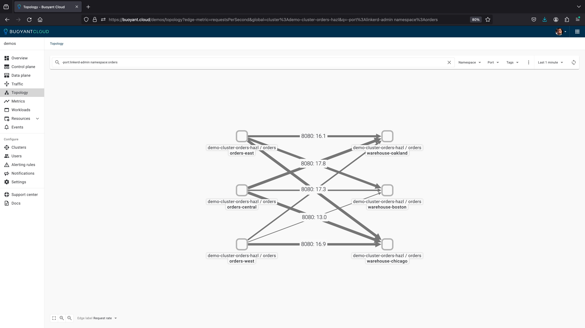

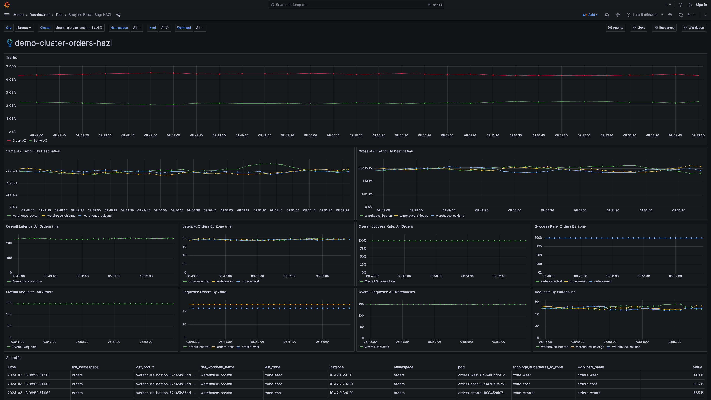


We can see that traffic from each `orders` deployment is flowing to all three `warehouse` deployments, and that about 2/3 of total traffic is out of zone. Latency is hovering around 80 ms per zone, and Requests By Warehouse has some variation over time. All deployments are currently scaled to one replica.

**_Let's see what happens when we enable HAZL._**

### Enable High Availability Zonal Load Balancing (HAZL)

Let's take a look at how quick and easy we can enable **High Availability Zonal Load Balancing (HAZL)**.

Remember, to make adjustments to your **BEL** deployment _simply edit and re-apply the previously-created `linkerd-control-plane-config-hazl.yaml` manifest_. We're going to **enable** the `- -ext-endpoint-zone-weights` in the `additionalArgs` for now, by uncommenting it in the manifest:

Edit the `linkerd-control-plane-config-hazl.yaml` file:

```bash
vi linkerd-control-plane-config-hazl.yaml
```

Apply the ControlPlane CRD config to have the Linkerd BEL operator update the Linkerd control plane configuration, and enable HAZL _on the `hazl` cluster only_:

```bash
kubectl apply -f linkerd-control-plane-config-hazl.yaml --context orders
```

```bash
kubectl apply -f linkerd-control-plane-config-hazl.yaml --context warehouse
```

Now, we can see the effect **HAZL** has on the traffic in our multi-az cluster.

### Monitor Traffic With HAZL Enabled

Let's take a look at what traffic looks like with **HAZL** enabled, using **Buoyant Cloud**. This will give us a more visual representation of the effect of **HAZL** on our traffic.

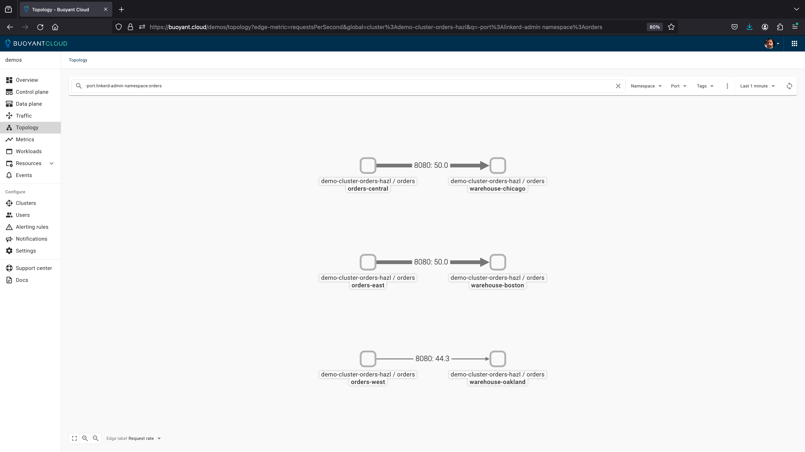

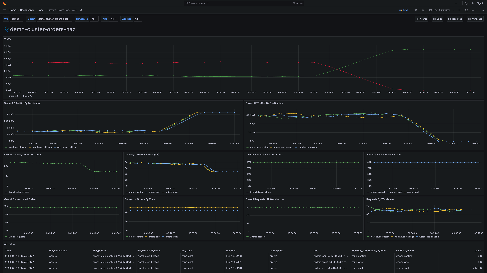


With HAZL enabled, we see traffic stay in zone, at 50 requests per second.  Cross-AZ traffic drops to zero, latency by zone drops to around 50 ms and Requests By Warehouse smooths out. Application load stays consistent and all deployments remain at one replica.

### Increase Orders Traffic in `zone-east`

A popular sitcom aired an episode in which the characters, a bunch of middle-aged Generation X folks, flash back to their teenage years, and remember the joy they experienced playing hacky sack together. Our characters decide they're going to relive those wonderful hacky sack memories, and go online to order supplies, featuring _our_ website and products. **_Jackpot!_**

Let's simulate what that looks like. The first thing we see is an uptick of orders in `zone-east`, as they're the first to watch the episode.

We can increase traffic in `zone-east` by scaling the `orders-east` deployment.  Let's scale to 10 replicas.

```bash
kubectl scale -n orders deploy orders-east --replicas=10 --context orders
```

Let's see the results of scaling `orders-east`:

```bash
watch -n 1 kubectl get deploy,hpa -n orders --context warehouse
```

**_Use `CTRL-C` to exit the watch command._**

Let's take a look at what the increased traffic looks like in **Buoyant Cloud**. This will give us a more visual representation of the effect of **HAZL** on our traffic.

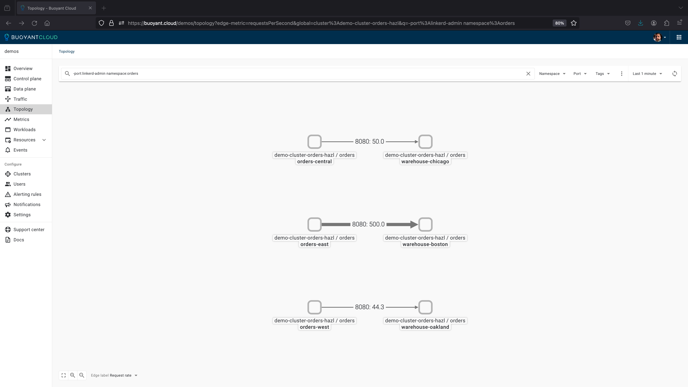

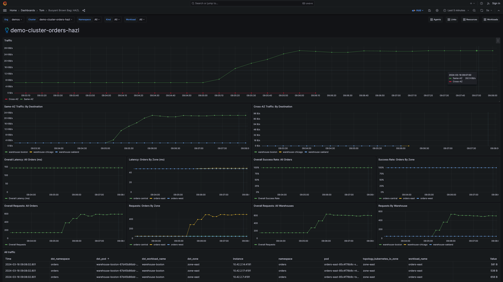

After scaling `orders-east` to 10 replicas, traffic remains in the same AZ and latency holds steady at around 50 ms. Order success remains at 100%.

### Increase Orders Traffic in `zone-central`

The middle of the country _really_ liked our hacky sacks! Order volume is running more than double what we saw in `zone-east`.

We can increase traffic in `zone-central` by scaling the `orders-central` deployment.  Let's scale to 25 replicas.

```bash
kubectl scale -n orders deploy orders-central --replicas=25 --context orders
```

Let's see the results of scaling `orders-central`:

```bash
watch -n 1 kubectl get deploy,hpa -n orders --context warehouse
```

**_Use `CTRL-C` to exit the watch command._**

Let's take a look at what the increased traffic looks like in **Buoyant Cloud**. This will give us a more visual representation of the effect of **HAZL** on our traffic.

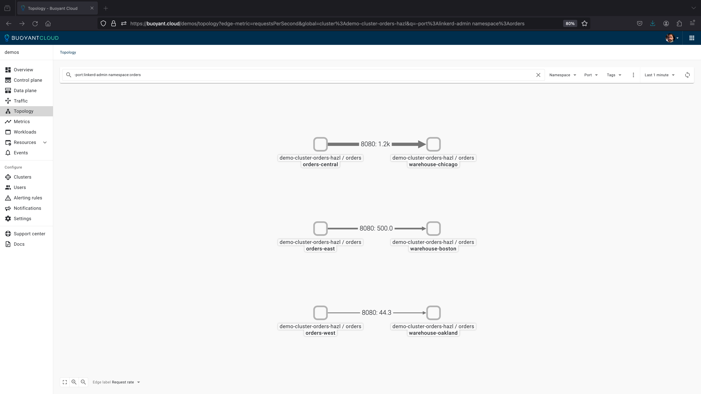

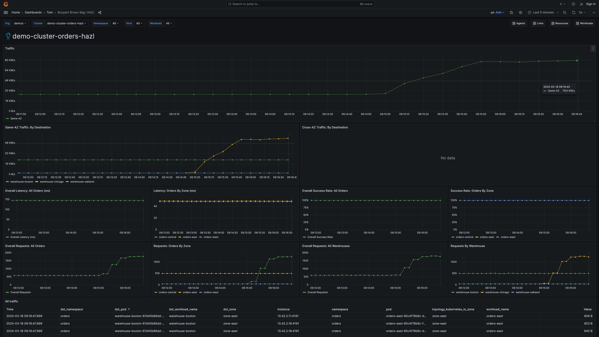

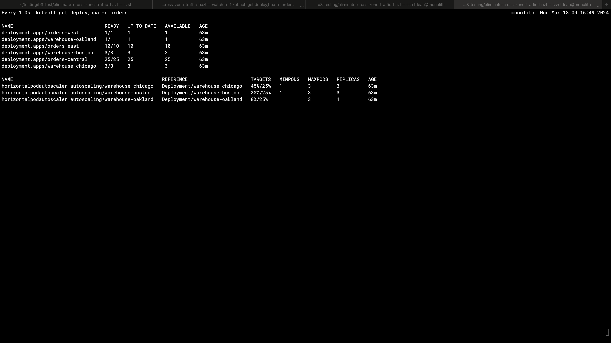

Again, after scaling `orders-central` to 25 replicas, all traffic remains in the same AZ and latency holds steady at around 50 ms. Order success remains at 100%. Both `warehouse-boston` and `warehouse-chicago` have autoscaled to 3 replicas.

### Increase Orders Traffic in `zone-west`

By now, word of the episode is all over social media, and when the episode airs in Pacific time, orders in `zone-west` spike.

We can increase traffic in `zone-west` by scaling the `orders-west` deployment.  Let's scale to 30 replicas.

```bash
kubectl scale -n orders deploy orders-west --replicas=30 --context orders
```

Let's see the results of scaling `orders-west`:

```bash
watch -n 1 kubectl get deploy,hpa -n orders --context warehouse
```

**_Use `CTRL-C` to exit the watch command._**

Let's take a look at what the increased traffic looks like in **Buoyant Cloud**. This will give us a more visual representation of the effect of **HAZL** on our traffic.

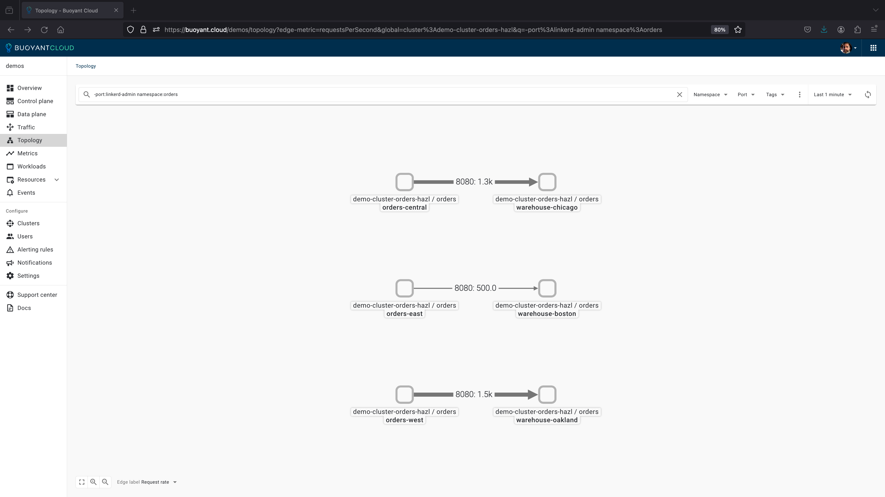

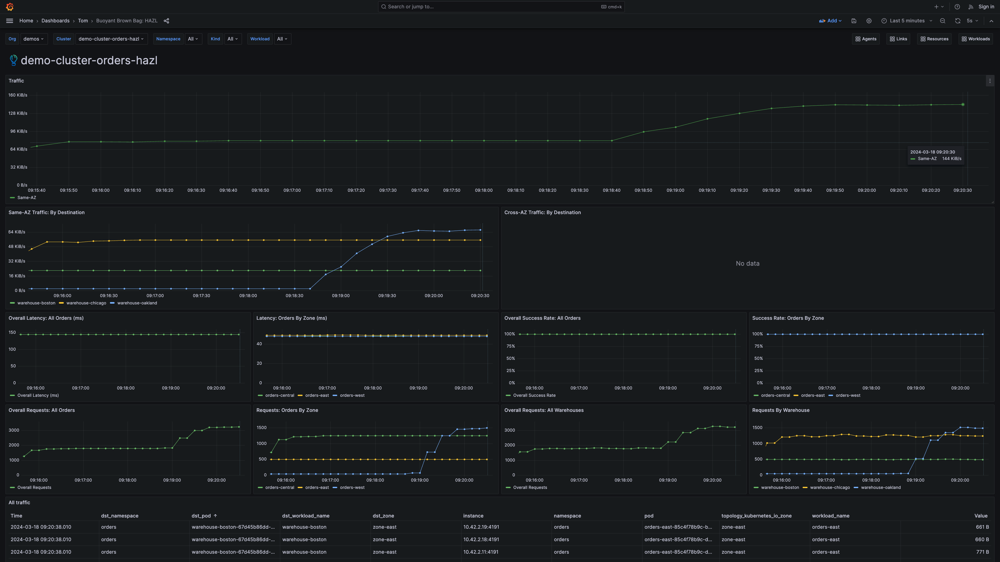

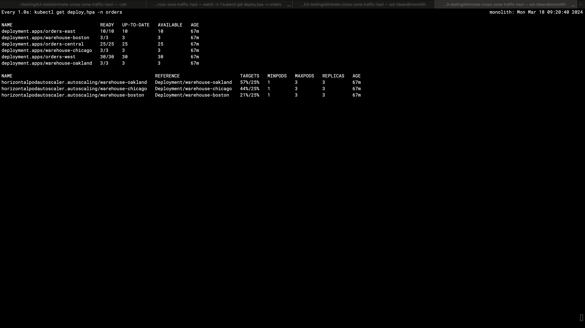

Once more, after scaling `orders-west` to 30 replicas, all traffic remains in the same AZ and latency holds steady at around 50 ms. Order success remains at 100%. Both `warehouse-boston`, `warehouse-chicago` and `warehouse-oakland` have autoscaled to 3 replicas.

**_So far, everything has gone right. What about when things go wrong?_**

### Increase Latency in `zone-central`

Unfortunately, we've had some network issues creep in at our Chicago warehouse!

We can increase latency in `zone-central` by editing the `warehouse-config` configmap, which has a setting for latency.

```bash
kubectl edit -n orders cm/warehouse-config --context warehouse
```

You'll see:

```yml
data:
  blue.yml: |
    color: "#0000ff"
    averageResponseTime: 0.020
  green.yml: |
    color: "#00ff00"
    averageResponseTime: 0.020
  red.yml: |
    color: "#ff0000"
    averageResponseTime: 0.020
```

The colors map to the warehouses as follows:

- Red: This is the Oakland warehouse (`warehouse-oakland`)
- Blue: This is the Boston warehouse (`warehouse-boston`)
- Green: This is the Chicago warehouse (`warehouse-chicago`)

Change the value of `averageResponseTime` under `green.yml` from `0.020` to `0.920`. Save and exit.

We need to restart the `warehouse-chicago` deployment to pick up the changes:

```bash
kubectl rollout restart -n orders deploy warehouse-chicago --context warehouse
```

Let's take a look at what the increased latency looks like in **Buoyant Cloud**. This will give us a more visual representation of the effect of **HAZL** on our traffic in response to increased latency.

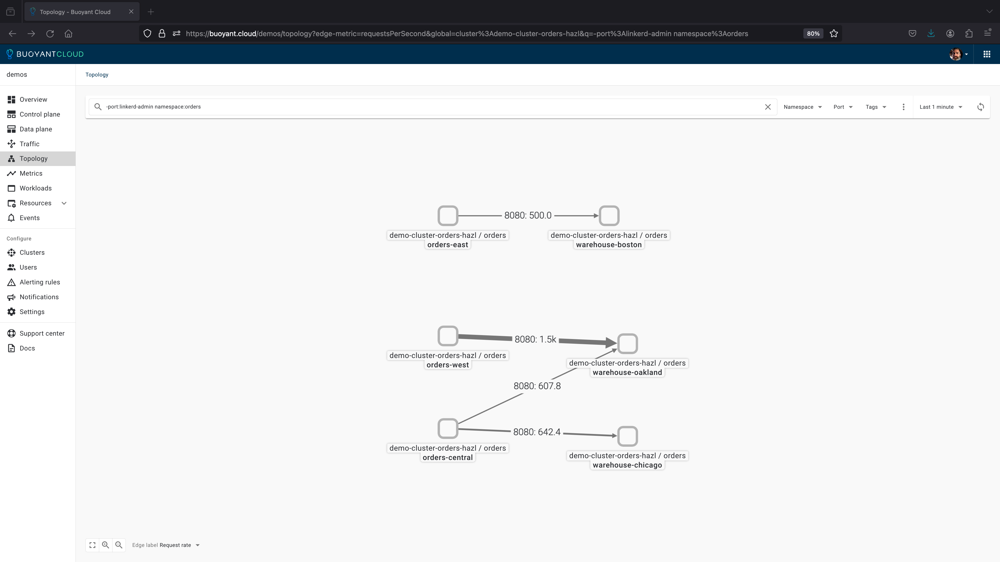

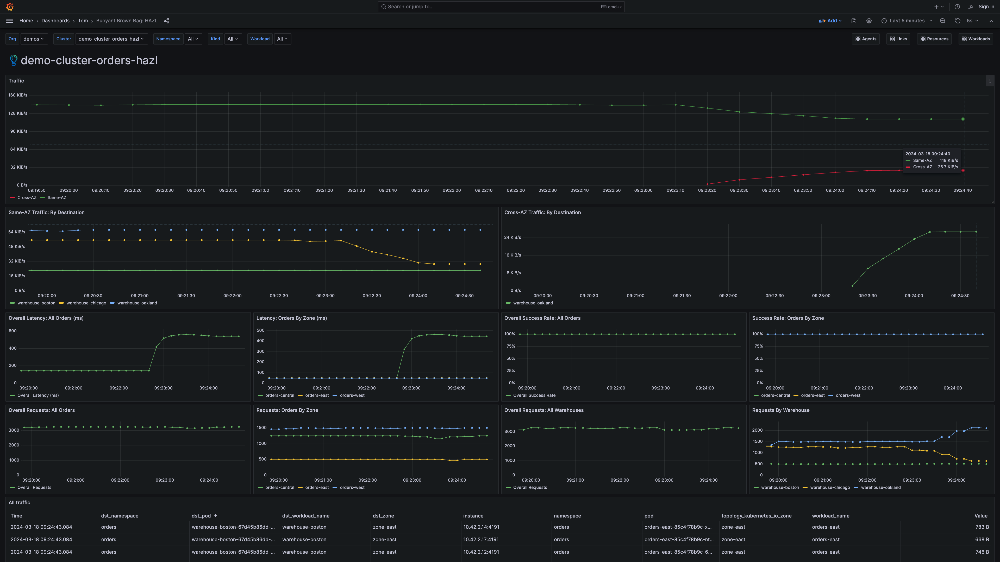

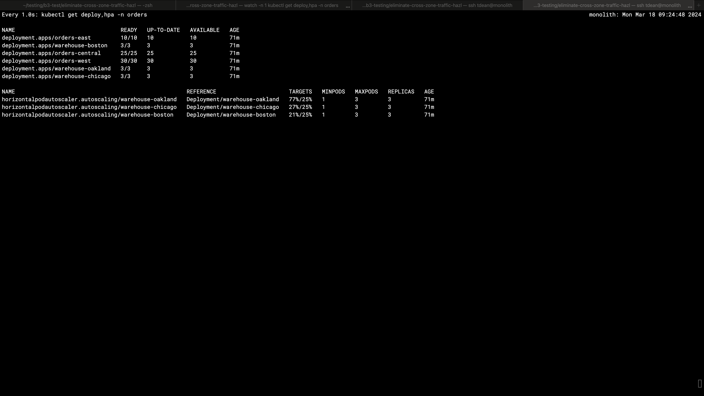

HAZL steps in and does what it needs to do, redirecting a portion of the traffic from `orders-central` across AZs to `warehouse-oakland` to keep success rate at 100%. Latency increases in `orders-central`, but HAZL adjusts.

### Take the `warehouse-chicago` Deployment Offline in `zone-central`

More bad news! The latency we've been experiencing is about to turn into an outage!

We can simulate this by scaling the `warehouse-chicago` deployment.  Let's scale to 0 replicas.

```bash
kubectl scale -n orders deploy warehouse-chicago --replicas=0 --context warehouse
```

Let's see the results of scaling `warehouse-chicago` to 0:

```bash
watch -n 1 kubectl get deploy,hpa -n orders --context warehouse
```

**_Use `CTRL-C` to exit the watch command._**

Let's take a look at what the increased traffic looks like in **Buoyant Cloud**. This will give us a more visual representation of the effect of **HAZL** on our traffic.

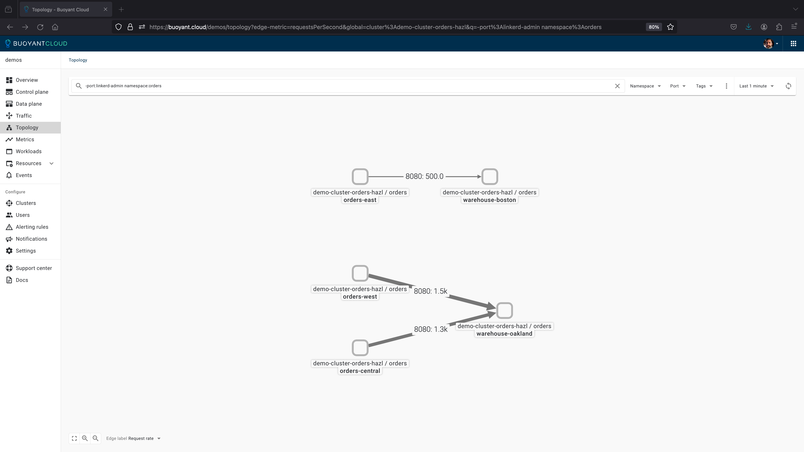

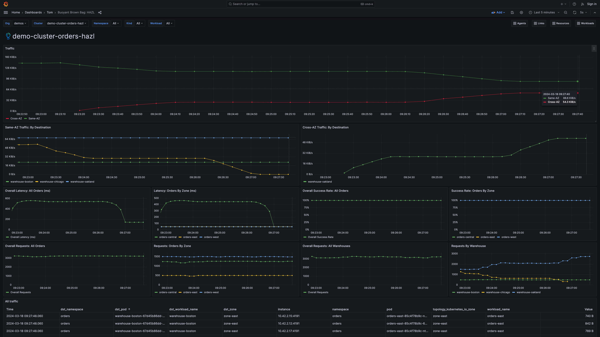


Once again, HAZL steps in and does what it needs to do, redirecting all of the traffic from `orders-central` across AZs to `warehouse-oakland` to keep success rate at 100%. Latency drops in `orders-central` as we are no longer sending traffic to `warehouse-chicago`, which added latency.

### Bring the `warehouse-chicago` Deployment Back Online and Remove Latency

Good news! The latency and outage is about to end!

We can simulate this by scaling the `warehouse-chicago` deployment.  Let's scale to 1 replica. The Horizontal Pod Autoscaler will take over from there.

```bash
kubectl scale -n orders deploy warehouse-chicago --replicas=1 --context warehouse
```

We also need to edit the `warehouse-config` configmap, and set the latency to match the other `warehouse` deployments.

```bash
kubectl edit -n orders cm/warehouse-config --context warehouse
```

We need to restart the `warehouse-chicago` deployment to pick up the changes:

```bash
kubectl rollout restart -n orders deploy warehouse-chicago --context warehouse
```

Let's see the results of scaling `warehouse-chicago` and restarting the deployment:

```bash
watch -n 1 kubectl get deploy,hpa -n orders --context warehouse
```

**_Use `CTRL-C` to exit the watch command._**

Let's take a look at what the service restoration looks like in **Buoyant Cloud**. This will give us a more visual representation of the effect of **HAZL** on our traffic.


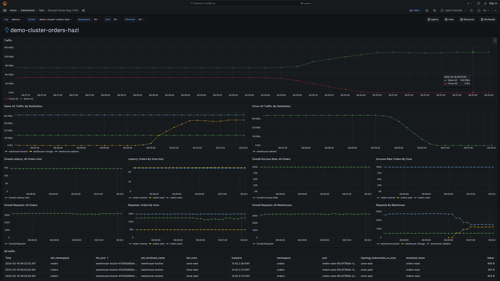

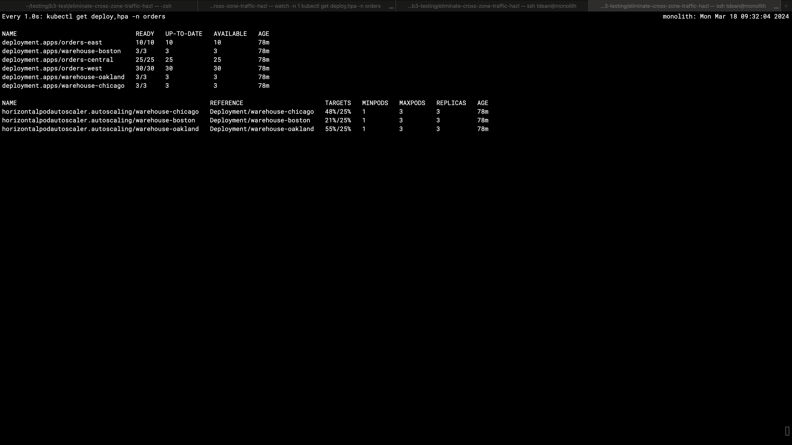

We can see things have returned to 100% in-zone traffic, with latency back to about 50 ms across the board and success rates at 100%.  HPA has 3 replicas of the `warehouse` deployments per zone.

### Reset the Orders Application

Now that we're finished, let's reset the Orders application back to its initial state.

```bash
kubectl apply -k orders/orders --context orders
```

```bash
kubectl apply -k orders/warehouse --context warehouse
```

Let's see the results of the reset:

```bash
watch -n 1 kubectl get deploy,hpa -n orders  --context warehouse
```

**_Use `CTRL-C` to exit the watch command._**

If we give things a minute to settle back down, we should see all traffic back in zone and request rates back to 50.

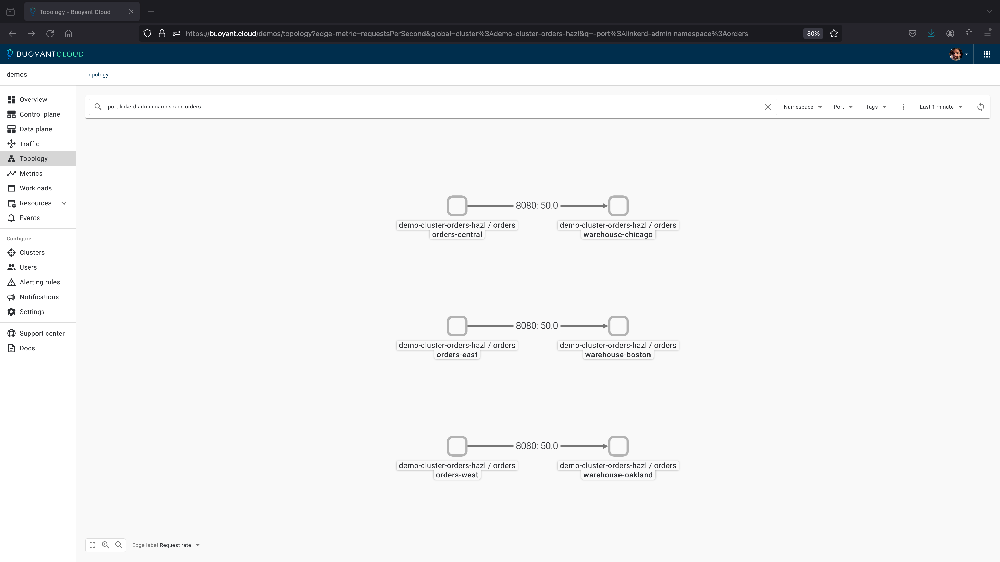

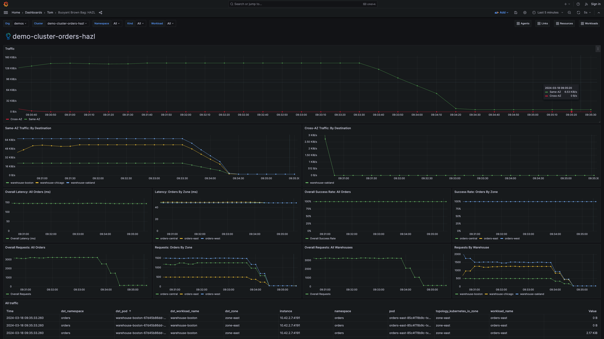


Everything has returned to the initial state with HAZL enabled. All deployments are a single replica, all traffic remains in-zone, and success rates are 100%.  Looking good!

### Demonstration: Cleanup

You can clean up the Demonstration environment by running the included script:

```bash
./destroy-clusters.sh
```

Checking our work:

```bash
k3d cluster list
```

We shouldn't see our `demo-cluster-orders-hazl` cluster.

## Summary: Deploying the Orders Application With High Availability Zonal Load Balancing (HAZL)

In this hands-on Demonstration, we deployed Buoyant Enterprise for Linkerd and demonstrated how to enable High Availability Zonal Load Balancing (HAZL). We also took a look at how HAZL works to keep network traffic in-zone where possible by exploring some different traffic, load and availability situations.

Thank you for taking a journey with HAZL and Buoyant!
